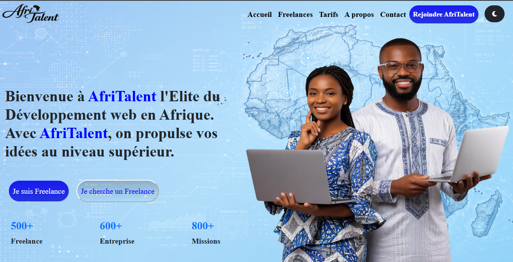
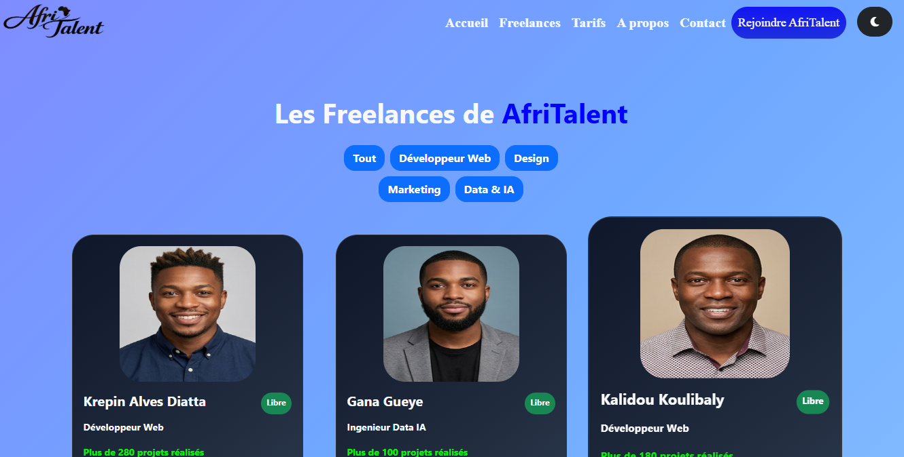
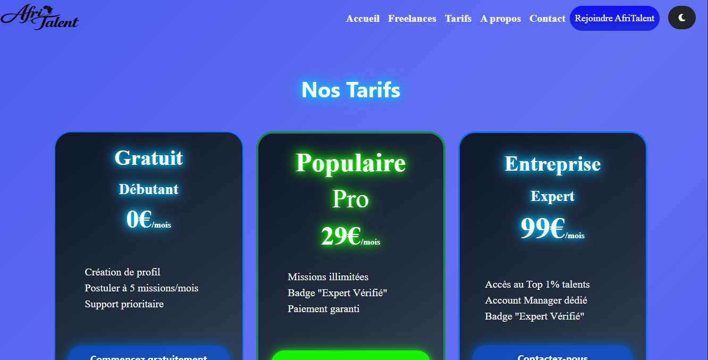
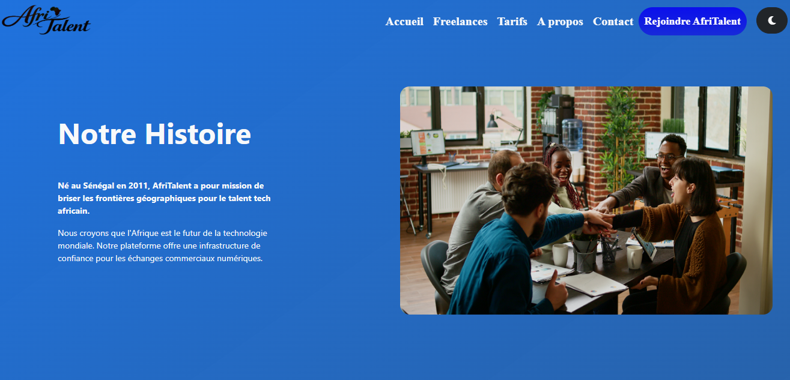
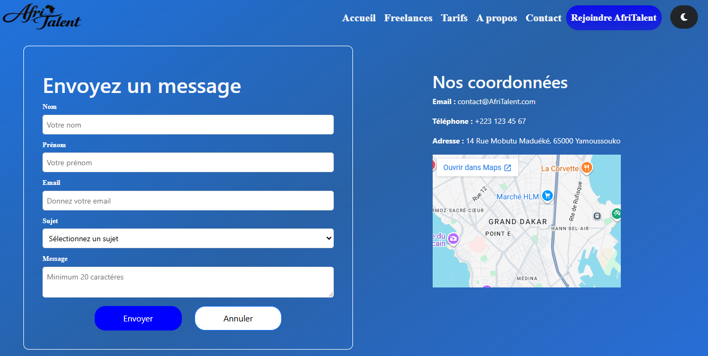

# AfriTalent
Projet fil rouge — Plateforme de mise en relation entre freelances africains et
clients.
Auteur : Papa Mamadou Ndao
Promotion : L1 IAGE — ISI

# Description
AfriTalent est un site de freelance de developpeur Africian qui permet connecter les freelances africains  avec des entreprises à la recherche de compétences digitales. Le site présente la plateforme, ses services, ses tarifs, les profils de freelances , invite les visiteurs à s'inscrire et de postuler en tant que freelance

# Technologie utilisés
- HTML : Pour la structure sémantique des 5 pages
- CSS : Pour la stylisation, le Bento grid , les animations et la responsivité
- Bosstrap : Pour la navbar , les cards , le carousel et les accordion
- Font Awesome : Pour les icones
- Google Fonts : Pour les polices
- Javascript : Pour le theme clair , le compteur animé , le filtrage des carteset la validation du formulaire
- Github : Pour enregistrer chaque étpae de notre projet

# Les pages du site
- index.html:Page d'accueil (Hero, Comment ça marche, Catégories, Témoignages, CTA)
- freelances.html:Liste des freelances de Afritalent avec filtrage dynamique
- tarifs.html: Les differents options (Gratuit / Pro / Entreprise) et les questions importants ( accordion)
- about.html: Histoire, équipe, valeurs, chiffres clés
- contact.html: Formulaire de contact avec validation Javascript et une carte Google Maps


# Les fonctionalités Javascript utilisées dans ce projet
- Dark mode et le Light mode : Integrer dans la navbar et sauvegardé dans localStorage
- Compteurs animés :qui s'incrémente de 0 à leur valeur finale
- Filtrage des cartes freelances par catégorie sans rechargement de la page
- Validation du formulaire: champs requis, regex sur l'email, longueur minimum 20 caractères pour le message, messages d'erreur et de succes personnalisés
- Navbar dynamique qui change de style au scroll
- Animations fade-in:les sections apparaissent en fondu à l'entrée dans le viewport


# Arborescence du projet
```
Papa_Mamadou_Ndao_AfriTalent/
├── index.html
├── freelances.html
├── tarifs.html
├── about.html
├── contact.html
├── css/
│ └── style.css
├── js/
│ └── main.js
├── images/
│ └── (vos images, logos, avatars)
├── docs/
│ └── NOM_Prenom_Presentation.pptx
├── README.md
└── .gitignore
```

# Aperçu du site d'AfriTalent






# Lien GitHub Pages
https://papamamadoundao8-blip.github.io/Papa_Mamadou_Ndao_AfriTalent/

# Instructions pour lancer localement
1. Cloner le dépôt : git clone https://github.com/papamamadoundao8-blip/Papa_Mamadou_Ndao_AfriTalent.git
2. Ouvrir le dossier du projet
3. Ouvrir le fichier index.html directement dans votre navigateur

# Ressources consultées
- GRAFIKART : Pour l'explication du Javascript et du responsive
- MDN : Pour la documentation
- Youtube : Des vidéos tutoriels
- Magnific : Pour les images libre de droit
- Pinterest : Pour les images libre de droit
- Font Awesome: Pour les icônes
- W3C Validator: Validation HTML
- Boostrap : Pour la navbar, les cards, le caroussel et les accordions


